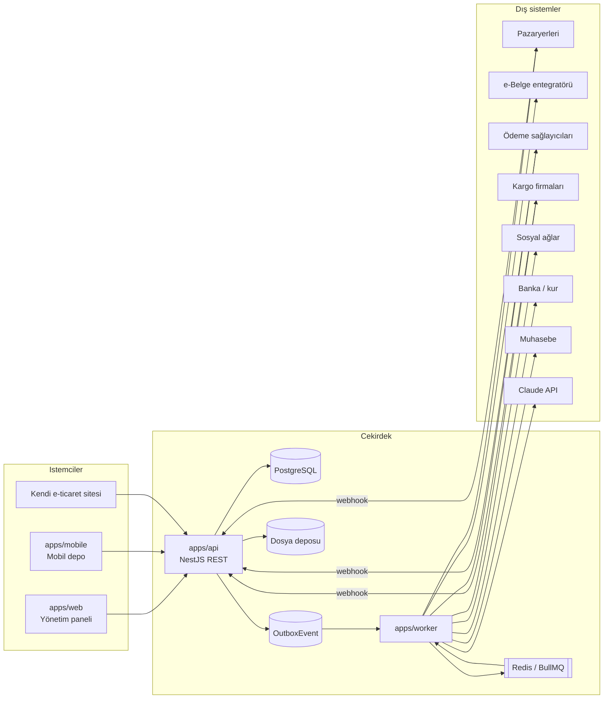

# 01 · Mimari

## İlkeler

1. **Modüler monolit.**
   - Tek API uygulaması, içinde modül klasörleri.
   - Modüller birbirinin tablolarına yazmaz; başka modülün verisine servis arayüzü üzerinden okur, başka modülü olayla tetikler.
   - İleride bir modül ayrı servise taşınabilir.
2. **Transactional outbox.**
   - İş kaydı ve olay aynı transaction'da yazılır.
   - Worker olayı kuyruğa aktarır, en az bir kez teslim eder. İşleyiciler idempotent olmalıdır.
3. **Adaptör katmanı.**
   - Her dış sistem aynı `IntegrationAdapter` arayüzünü uygular. Örneğin e-belge entegratörü değişirse yalnızca adaptör değişir.
   - Anahtar yoksa adaptör mock modunda çalışır; geliştirme ve testler dış sisteme bağımlı olmaz.
4. **Webhook önce, sorgu yedek.**
   - Pazaryeri, ödeme ve kargo durumları webhook ile alınır.
   - Kaçan olaylar için zamanlanmış sorgu işi çalışır.
5. **Çevrimdışı mobil.**
   - Mobil depo işlemleri cihazda kuyruklanır.
   - Her işlem istemci tarafında üretilen bir idempotency anahtarı taşır.

## Kritik akışlar

### Sipariş → teslimat

1. `order.created`: pazaryeri webhook'u, sitenin API'si veya B2B panelinden gelir.
2. Ödeme doğrulanır, sonuç `payment.captured` veya kapıda ödeme ise `order.confirmed` olur.
3. FEFO'ya göre lot rezervasyonu yapılır (`stock.reserved`) ve tüm kanallara stok itilir.
4. e-Arşiv veya e-Fatura kesilir (`invoice.issued`).
5. Toplama dalgasına eklenir, mobil depoda toplanır.
6. Kargo firması seçilir, etiket basılır (`shipment.created`).
7. Durum güncellemeleri müşteriye bildirilir (`shipment.status_changed`).
8. Teslimde sadakat puanı yazılır.

### Stok → üretim / satın alma

1. `stock.below_min` olayı gelir.
2. MRP işi çalışır: mamul eksikse üretim önerisi, hammadde veya ambalaj eksikse satın alma talebi (`requisition.created`) oluşturur.

### Mal kabul → kalite → kullanım

1. `lot.received`: lot karantinada açılır.
2. QC muayenesi yapılır.
3. Test geçerse `lot.released` ile lot kullanılabilir olur; kalırsa `lot.quarantined` ve bir DÖF açılır.

## Ortamlar

- **local:** Docker Compose.
- **staging:** Sandbox anahtarlar, anonimleştirilmiş veri.
- **production:** Barındırma kararı ADR-0002'de verilecek.

## Gözlemlenebilirlik

- Yapılandırılmış loglar (JSON) ve istek kimliği.
- Entegrasyon başına başarı oranı ve gecikme, kuyruk uzunluğu.
- Ölü mektup kuyruğu için alarm.
