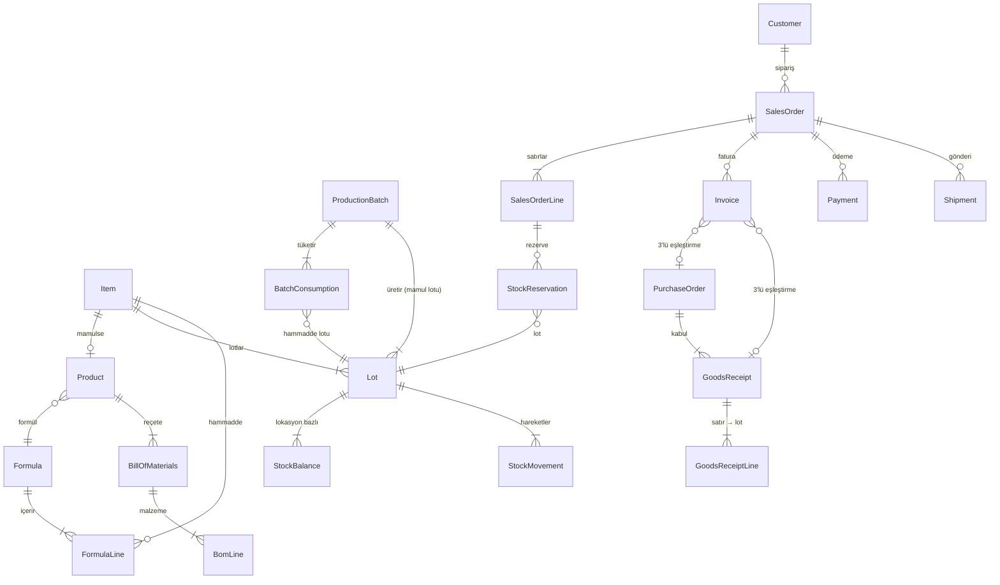

# 02 · Veri modeli

Kaynak: `packages/db/prisma/schema.prisma`. Bu doküman şemanın neden böyle olduğunu anlatır. Şema değişince burası da güncellenir.

## Alanlar

| # | Alan | Başlıca tablolar |
|---|---|---|
| 1 | Kimlik, yetki, denetim | User, Session, Role, UserRole, RolePermission, ApprovalRule, ApprovalRequest, AuditLog |
| 2 | Ürün, formül, koku | Item, Product, ProductContent, ProductMedia, Formula, FormulaLine, FormulaAllergen, BillOfMaterials, BomLine, ScentNote, ProductNote, ProductAccord |
| 3 | Depo, lot, stok | Warehouse, Location, Lot, StockBalance, StockMovement, StockReservation, CycleCount(+Line), DeviceTask, PickWave(+Line) |
| 4 | Satın alma | Supplier, SupplierItem, PurchaseRequisition, PurchaseOrder(+Line), GoodsReceipt(+Line) |
| 5 | Üretim | Resource, ProductionBatch, ProductionStageLog, BatchConsumption, ScheduleSlot |
| 6 | Kalite & mevzuat | QcTest, QcInspection, QcResult, NonConformance, ComplianceDocument, Recall |
| 7 | Maliyet | StandardCost, BatchCost |
| 8 | Müşteri, satış, kanal | Customer, Address, SalesChannel, PriceList(+Item), SalesOrder(+Line), Opportunity, ChannelListing |
| 9 | Ödeme, hakediş, banka | PaymentProvider, Payment, Settlement(+Line), BankTransaction |
| 10 | Fatura, irsaliye, vergi | Invoice, InvoiceLine, DispatchNote, TaxRule, TaxCalendarEvent |
| 11 | Kargo & iade | Carrier, Shipment, ShipmentEvent, ReturnRequest |
| 12 | Sadakat & abonelik | LoyaltyTier, LoyaltyAccount, LoyaltyTransaction, SubscriptionPlan, Subscription, SubscriptionBox, RefillReturn |
| 13 | Koku AI | ScentQuizResult, Recommendation, ScentSearchLog |
| 14 | Pazarlama & içerik | SocialAccount, SocialPost, ContentBrief, ContentAsset |
| 15 | Entegrasyon & olay | Integration, IntegrationLog, OutboxEvent |

## Çekirdek ilişkiler



## Tasarım kararları

- **Item / Product ayrımı.** Stokta duran her şey (esans, şişe, yarı mamul, mamul, numune) bir `Item`'dır. Yalnızca satılabilir mamullerin ticari bilgisi (SKU, barkod, GTİP, vergi kategorisi, içerik, kanal ilanı) `Product`'ta tutulur. Böylece stok, lot ve maliyet tek yerde kalır.
- **Lot her yerde zorunlu.**
  - `StockBalance`, `StockMovement`, rezervasyon ve üretim tüketimi hep lot üzerinden yürür.
  - Lot takibi gerektirmeyen kalemler (ör. selofan) için kalem başına tek bir "GENEL" lot açılır.
  - Bu sayede geri çağırma zinciri (hammadde lotu → parti → mamul lotu → sipariş satırı → müşteri) kopmaz.
- **Hareket defteri.** `StockMovement` yalnızca eklenir (append-only); elle yapılan düzeltme ve transferlerde gerekçe `note` alanına yazılır. `StockBalance` bu hareketlerden türetilmiş bir önbellektir ve yalnızca `packages/db/src/stock.ts` tarafından güncellenir. Gece bir tutarlılık işi, hareket toplamlarıyla bakiyeleri karşılaştırır.
- **Rezervasyon.**
  - `StockReservation` yalnızca satış sipariş satırına değil, her türlü iç kullanıma bağlanabilir: `refType`/`refId` (ör. `SalesOrderLine`, `ProductionBatch`, `Manual`). `orderLineId` isteğe bağlıdır; satış rezervasyonunda doldurulur.
  - Rezervasyon `StockBalance.qtyReserved` alanını artırır. Serbest bırakma (`releasedAt`) ve rezervasyonun sevkiyatla tüketilmesi bu alanı azaltır. Hepsi `packages/db/src/stock.ts` içinde, aynı transaction'da yapılır.
- **Min stok bildirimi.** `Item.belowMinNotifiedAt`, `stock.below_min` olayının aynı kalem için 24 saatte en fazla bir kez yayınlanmasını sağlar (STK-05).
- **Sayım onayı.** `CycleCount` onay bilgisini tutar: `varianceValue`, `needsApproval`, `submittedAt`, `approvedById`, `approvedAt`. Farkın değeri eşiği aşarsa ya da farkı olan bir kalemin maliyeti bilinmiyorsa onay gerekir (STK-09). Onaylanınca farklar `ADJUSTMENT` hareketi olarak yazılır; reddedilen sayım yeniden sayıma açılır (`OPEN`).
- **Parametreler.** `SystemSetting` (anahtar → JSON değer) iş kurallarının ayarlanabilir değerlerini tutar: SKT uyarı günü, kanal stok tamponu, sayım onay eşiği vb. Varsayılanlar `packages/shared/src/settings.ts` içindedir. Değişiklik `AuditLog` yazar. Bu tabloya gizli anahtar veya kimlik bilgisi (kural 8) ve vergi oranı (`TaxRule`) yazılmaz.
- **Onay talebi içeriği.** `ApprovalRequest.payload`, onaylanınca uygulanacak değişikliği tutar (ör. yetki matrisi hücresi, YTK-02).
- **Vergi anlık görüntüsü.** Sipariş ve fatura satırları, işlem anındaki `otvRate`/`kdvRate` değerlerini kopyalar. `TaxRule` sonradan değişse de eski belge değişmez.
- **Brüt fiyat.** Kanal fiyat listeleri varsayılan olarak KDV dahil tutulur (`pricesIncludeTax`). Vergi ayrıştırması `packages/shared/src/tax.ts` ile yapılır.
- **Para birimi.** Yabancı para birimli belgelerde `currency` ve `fxRate` saklanır, raporlama TRY karşılığıyla yapılır. Kur kaynağı `docs/04` içinde tanımlı.
- **Formül sürümü.** `Formula` alanında `(code, version)` benzersizdir. Onaylı bir formül düzenlenmez, yeni sürümü açılır. Parti, üretildiği sürüme bağlanır.
- **Oturum.** Web ve mobil cihaz oturumları `Session` tablosunda tutulur (`kind`: WEB, DEVICE). İstemciye rastgele bir token verilir; veritabanında yalnızca SHA-256 hash'i (`tokenHash`) saklanır. Süreler parametriktir: web 8 saat, cihaz 12 saat (`SESSION_TTL_HOURS`, `DEVICE_SESSION_TTL_HOURS`). Çıkış ve iptal `revokedAt` ile yapılır, kayıt silinmez.
- **İki adımlı doğrulama.** `User.totpSecretEnc` TOTP sırrını alan şifrelemesiyle (AES-256-GCM, `packages/shared/src/node/pii.ts`) saklar. `totpLastCounter` aynı kodun ikinci kez kullanılmasını engeller. `failedLoginCount` ve `lockedUntil` kaba kuvvet denemelerinde hesabı geçici olarak kilitler.
- **Denetim kaydı.** `AuditLog` tablosunda UPDATE, DELETE ve TRUNCATE, `audit_log_append_only` migration'ındaki trigger ile veritabanı seviyesinde engellenir.
- **Kişisel veri.** `Customer.taxNo`, `phone` ve `email` uygulama katmanında şifrelenir; arama için ayrı hash sütunu eklenir (Faz 1). Sınıflandırma `07-guvenlik-kvkk.md` dosyasında.
- **Silme yok.** Kritik tablolarda (fatura, hareket, denetim, lot) kayıt silinmez; durum alanı değişir. Cascade silme kullanılmaz.
- **Benzerlik vektörü.** `Product.embedding` şimdilik `Float[]` olarak tutuluyor. Katalog 1.000 ürünü geçerse pgvector'e taşınacak (ADR yazılır).

## Lot izlenebilirliği sorgusu

Geri çağırma simülasyonu şu zinciri izler:

```
Lot (mamul) ← ProductionBatch.outputLots
ProductionBatch → BatchConsumption → Lot (hammadde/ambalaj) → GoodsReceiptLine → PurchaseOrder → Supplier
Lot (mamul) → StockReservation / StockMovement(SALE) → SalesOrderLine → SalesOrder → Customer, SalesChannel
Lot (mamul) → StockBalance (hâlâ depoda olanlar)
```

Hedef süre: 10.000 siparişlik veride 2 saniyenin altında. Gerekli indeksler şemada tanımlı.

## Olaylar

Modüller arası tüm tetiklemeler bu tablodaki olaylarla yapılır. Tipler `packages/shared/src/events.ts` dosyasında; bu tablo ile birebir aynı olmalıdır.

| Olay | Yayınlayan | Dinleyenler |
|---|---|---|
| `order.created` | satış, e-ticaret (pazaryeri çekme) | ödeme, kontrol paneli |
| `order.confirmed` | ödeme / satış | stok (rezervasyon), fatura, sadakat |
| `order.cancelled` | satış | stok (rezervasyon iadesi), ödeme (iade), fatura (iptal) |
| `payment.captured` | ödeme | satış (siparişi onayla) |
| `payment.failed` | ödeme | satış, sadakat (abonelik PAST_DUE) |
| `stock.reserved` | stok | depo (toplama dalgası), kargo |
| `stock.below_min` | stok | satın alma (MRP), üretim (MRP), kontrol paneli |
| `stock.changed` | stok | e-ticaret (kanallara stok it) |
| `lot.received` | satın alma (mal kabul) | kalite (muayene aç) |
| `lot.released` | kalite | stok (kullanılabilir), üretim |
| `lot.quarantined` | kalite | stok (çıkışları kilitle), satın alma (tedarikçi puanı) |
| `batch.stage_changed` | üretim | kontrol paneli, kalite (QC aşaması) |
| `batch.completed` | üretim | stok (mamul girişi), maliyet (parti kapanışı), kalite |
| `requisition.created` | satın alma (MRP) | kontrol paneli, yetki (onay) |
| `po.approved` | satın alma | tedarikçiye e-posta, mobil depo (kabul görevi) |
| `invoice.issued` | fatura | satış, muhasebe aktarımı, e-posta |
| `invoice.failed` | fatura | kontrol paneli (hata kuyruğu) |
| `invoice.purchase_received` | fatura (gelen e-Fatura) | satın alma (3'lü eşleştirme) |
| `shipment.created` | kargo | satış, e-ticaret (takip no'yu kanala bildir) |
| `shipment.status_changed` | kargo | satış, müşteri bildirimi, sadakat (teslimde puan) |
| `shipment.delayed` | kargo | müşteri bildirimi, kontrol paneli |
| `return.requested` | satış / e-ticaret | kargo (iade etiketi), kalite (hasar kontrolü) |
| `product.updated` | ürün kartı | e-ticaret (içerik senkronu), koku AI (vektör güncelle) |
| `price.changed` | satış / vergi | e-ticaret (fiyat it), denetim |
| `compliance.changed` | kalite | ürün (SALES_LOCKED ↔ ACTIVE), e-ticaret |
| `quiz.completed` | koku AI | CRM (profil), sadakat, pazarlama |
| `post.published` | sosyal medya | kontrol paneli, satış (UTM atıfı) |
| `subscription.renewed` | sadakat | ödeme (tahsilat), üretim (numune dolumu), kargo |
| `tax_rule.changed` | vergi | e-ticaret (fiyat kontrolü), denetim |
| `system.ping` | yönetim (sistem sağlığı) | worker (uçtan uca olay hattı testi; yalnızca loglanır) |

## Tohum verisi

Tohum verisi Faz 0'da `packages/db/prisma/seed.ts` içinde hazırlanır. Prototipteki örnek verilerle tutarlı olmalıdır:

- **Roller:** Roller ve `RolePermission` matrisi (`03-moduller/yetki.md`).
- **Depolar:** 3 depo (Ana depo, Soğuk oda 12–15°C, E-ticaret deposu) ve lokasyonlar (A1-03, B4-02, B6-03, D2-01, E1-04 …).
- **Kalemler:**
  - Hammaddeler: Noir Ambré konsantre, bergamot esansı, etil alkol 96°, gül absolü, vanilya ekstresi, oud aroma baz.
  - Ambalajlar: cam şişe 50/100 ml, FEA 15 pompa, kapak, kutu, etiket.
- **Ürünler:** Noir Ambré EDP 50/100 ml, Oud Mystique EDP 100 ml, Velvet Iris EDP 100 ml, Citrus Néroli EDT 50 ml, Musc Blanc EDP 30 ml, Keşif seti 5 × 10 ml. Her birinin notaları, akorları ve formülü de tohumlanır.
- **Satış kanalları:** WEB, TRENDYOL, HEPSIBURADA, AMAZON_TR, N11, CICEKSEPETI, B2B, STORE, EXPORT, SUBSCRIPTION.
- **Kargo firmaları:** YURTICI, ARAS, MNG, PTT, TRENDYOL_EXPRESS, HEPSIJET.
- **Ödeme sağlayıcıları:** IYZICO, PAYTR, STRIPE, BANK_POS, TRANSFER, COD, MARKETPLACE.
- **TaxRule:** PERFUME (KDV 0,20 · ÖTV 0,20), COLOGNE (KDV 0,20 · ÖTV 0), EXPORT (0 · 0). Tümü `note: "teyit bekliyor"` ile girilir; bkz. `04-entegrasyonlar.md#dogrulanacaklar`.
- **Sadakat:** 3 seviye (Keşif, Koleksiyoner, Atelier) ve 1 abonelik planı.
