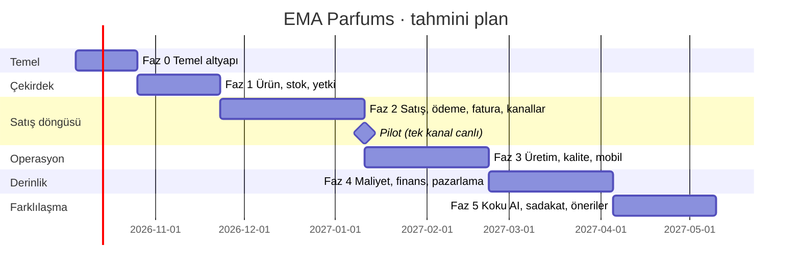

# 05 · Yol haritası

Her faz, bir öncekinin çıkış kriterleri sağlandıktan sonra başlar. Süreler, 1–2 geliştirici ve Claude Code ile çalışan bir ekip için **tahmindir**. Görev kodları `/faz` komutu ve commit mesajlarında kullanılır (`feat(stock): F1-03 recordMovement`).

Kutucuklar görev bitince işaretlenir: `- [x]`.

---

## Faz 0 · Temel altyapı (≈3 hafta)

**Amaç:** Her modülün üzerine oturacağı iskelet: kimlik, yetki, denetim, olaylar, entegrasyon çerçevesi, tasarım sistemi.

- [x] **F0-01** Monorepo kurulumu: `apps/web` (Next.js), `apps/api` (NestJS), `apps/worker`; ortak tsconfig, ESLint, Prettier, Vitest.
- [x] **F0-02** `packages/db`: `prisma generate`, ilk migration, `AuditLog` için UPDATE/DELETE engelleyen trigger migration'ı.
- [x] **F0-03** Tohum verisi (`docs/02-veri-modeli.md#tohum-verisi`).
- [x] **F0-04** Kimlik doğrulama: e-posta + parola, iki adımlı doğrulama (TOTP), oturum; cihaz token'ı (mobil için).
- [x] **F0-05** `@RequirePermission` guard + `RolePermission` tohumu (`03-moduller/yetki.md` matrisi); izinsiz uç tespit testi.
- [x] **F0-06** `AuditInterceptor` (önce/sonra kaydı).
- [x] **F0-07** Outbox: servis yardımcısı `emit(tx, event)`, worker'da `outbox-dispatcher`, BullMQ bağlantısı, ölü mektup kuyruğu.
- [x] **F0-08** `packages/integrations`: `IntegrationAdapter` kayıt defteri, mock adaptör şablonu, `IntegrationLog` yazıcı, maskeleme yardımcısı.
- [x] **F0-09** Alan şifreleme yardımcısı (TCKN/VKN/telefon) + arama hash'i.
- [x] **F0-10** Web kabuğu: kenar menü, üst bar, tasarım token'ları, `messages/tr.json`, giriş ekranı, izne göre menü.
- [x] **F0-11** CI: lint, typecheck, test, prisma validate; PR şablonu.
- [ ] **F0-12** ADR-0002 (barındırma ve KVKK), ADR-0004 (e-belge entegratörü), ADR-0005 (kendi site altyapısı) için karar dokümanları hazırlanır, kullanıcı kararı alınır. · _Dokümanlar hazır (docs/karar-kayitlari), kullanıcı kararı bekleniyor._

**Çıkış kriterleri**
- `docker compose up && pnpm db:migrate && pnpm db:seed && pnpm dev` temiz bir makinede çalışıyor.
- İzinsiz kullanıcı bir uca eriştiğinde 403 alıyor; test kapsamında.
- Bir örnek olay outbox'tan worker'a ulaşıyor ve loglanıyor.

---

## Faz 1 · Ürün, stok ve yetki çekirdeği (≈4 hafta)

**Amaç:** Doğru stok verisi. Diğer her şey buna dayanır.

- [x] **F1-01** Kalem (Item) ve ürün (Product) kartları: CRUD, barkod, GTİP, vergi kategorisi, notalar.
- [x] **F1-02** Formül ve reçete (BOM) kartları: sürümleme, onay, alerjen listesi.
- [x] **F1-03** `recordMovement()` stok servisi (STK-01…03) + testler.
- [x] **F1-04** FEFO rezervasyon servisi (STK-04) + eşzamanlılık testi.
- [x] **F1-05** Min stok ve SKT kuralları (STK-05, STK-08) + gece tutarlılık işi (STK-10).
- [x] **F1-06** Stok ekranları (prototip 03): liste, kalem detayı, depolar, hareketler.
- [x] **F1-07** Web üzerinden sayım (STK-09); mobil Faz 3'te.
- [x] **F1-08** `TaxRule` yönetimi + `packages/shared/src/tax.ts` entegrasyonu (VRG-01, VRG-02).
- [x] **F1-09** Yetki matrisi ve işlem geçmişi ekranları (prototip 17).
- [x] **F1-10** Kontrol paneli iskeleti: KPI kartları, canlı akış (SSE).

**Çıkış kriterleri**
- Tohum verisiyle prototipteki stok ekranı birebir üretiliyor.
- Stok servisinde kapsam ≥ %90; FEFO ve eşzamanlılık testleri geçiyor.
- Vergi oranı hiçbir yerde sabit kodlanmamış (`/kontrol`).

---

## Faz 2 · Satış döngüsü (≈7 hafta) → **Pilot**

**Amaç:** Tek bir kanalda gerçek sipariş: ödeme, fatura, kargo ve stok uçtan uca otomatik.

- [x] **F2-01** Müşteri ve adres, KVKK rıza kayıtları, Müşteri 360° temel görünümü.
- [x] **F2-02** Satış siparişi, durum makinesi, kanal önekleri, vergi anlık görüntüsü (SAL-01…07). · _SAL-01 kanal öneki, SAL-02 vergi anlık görüntüsü (lineFromGrossUnit), SAL-03 DRAFT/SALES_LOCKED engeli, SAL-06/07 durum makinesi + iptal, liste/detay/yeni sipariş arayüzü hazır. SAL-05 B2B kredi limiti ve pazaryeri harici dedup (SAL-01 externalOrderNo) pazaryeri adaptörleriyle (F2-11+) gelecek._
- [ ] **F2-03** `IYZICO` adaptörü + checkout + webhook (ODM-01…04). · _Kısmi: yerel SANDBOX ödeme akışı hazır — checkout (kart verisi alınmaz, ODM-01), imza doğrulamalı idempotent webhook (ODM-04), payment.captured → worker siparişi CONFIRMED yapar; sipariş detayında ödeme paneli + simülasyon. Gerçek IYZICO/PAYTR adaptörü (packages/integrations, hosted/3DS) canlıya çıkışta._
- [x] **F2-04** `PAYTR` adaptörü + yedek yönlendirme + ödeme linki.
- [x] **F2-05** `EINVOICE` adaptörü (seçilen entegratör): mükellef sorgusu, e-Arşiv, e-Fatura, durum, PDF (FTR-01…06, FTR-10).
- [x] **F2-06** Fatura ekranları (prototip 11) + hatalı belge kuyruğu.
- [x] **F2-07** Vergi kuralları ekranı + fiyat anatomisi temel sürümü (prototip 12).
- [x] **F2-08** `CARGO_YURTICI`, `CARGO_ARAS` adaptörleri, firma seçimi, etiket, takip (KRG-01…04, 07).
- [x] **F2-09** `SMS`/`WHATSAPP` ve `IYS`: işlem bildirimleri, izin kontrolü.
- [ ] **F2-10** `WEBSITE` entegrasyonu (ADR-0005 kararına göre). · _Bloke: ADR-0005 (kendi site altyapısı) kullanıcı kararı bekleniyor; karar sonrası yapılacak._
- [x] **F2-11** `TRENDYOL` adaptörü: sipariş çek, stok/fiyat it, ilan, fatura yükle (ETC-01…08).
- [x] **F2-12** `HEPSIBURADA` adaptörü.
- [x] **F2-13** E-ticaret ekranları (prototip 06): kanal kartları, listeleme sağlığı, kanal içeriği (AI olmadan elle).
- [x] **F2-14** Satın alma: tedarikçi, sipariş, onay akışı, web üzerinden mal kabul (SAT-03…05, 07).
- [x] **F2-15** MRP önerileri (SAT-01, SAT-02) + ekran (prototip 04).
- [x] **F2-16** Gelen e-Fatura + 3'lü eşleştirme (SAT-06, FTR-08).
- [x] **F2-17** `FX_TCMB` kur işi.
- [x] **F2-18** `mevzuat-denetcisi` incelemesi: fatura, vergi, KVKK. Kritik bulgu (e-Belge webhook imzasız → durum sahtelenmesi) düzeltildi: HMAC imza doğrulaması + iptal edilmiş belge terminal. Vergi/PCI/PII/İYS uyumlu bulundu. ÖNEMLİ bulgular (mükellefiyet sorgusu, iptal/itiraz süreleri, ihracat istisna kodu, alış ÖTV) `docs/04#dogrulanacaklar` listesine eklendi.

**Çıkış kriterleri (pilot)**
- Kendi sitede veya bir pazaryerinde 2 hafta boyunca gerçek siparişler insan müdahalesi olmadan faturalanıyor ve kargolanıyor.
- Stok farkı sıfır.
- `04-entegrasyonlar.md#dogrulanacaklar` listesinde vergi ve e-belge maddeleri teyit edildi.

---

## Faz 3 · Üretim, kalite ve mobil depo (≈6 hafta)

- [ ] **F3-01** Üretim partileri, aşamalar, maserasyon kilidi (URT-01…08). · _Kısmi: karışım kartı (esans/baz gramaj + %), aşama akışı + geçiş logu + olay (URT-08), maserasyon kilidi + erken geçiş onayı (URT-04), URT-01 onaylı formül kontrolü ve görsel arayüz (beher, maserasyon saati, aşama adımları) hazır. Kalan: URT-02 ölçekleme/eksik, URT-03 FEFO tüketim + BatchConsumption + maliyet, URT-07 hat planı._
- [ ] **F3-02** Hat planı (Gantt), kapasite kontrolü.
- [ ] **F3-03** Formül değişikliğinde IFRA limit kontrolü (URT-09), limit tablosu.
- [ ] **F3-04** Kalite: muayene şablonları, lot serbest bırakma, DÖF (KAL-01…03).
- [ ] **F3-05** Ürün uyum belgeleri ve `SALES_LOCKED` (KAL-04, KAL-05, KAL-07).
- [ ] **F3-06** İzlenebilirlik ve geri çağırma (KAL-06), performans testi.
- [ ] **F3-07** `apps/mobile`: Expo kurulumu, giriş, görevler (M1).
- [ ] **F3-08** Mobil mal kabul (M2), fotoğraf yükleme.
- [ ] **F3-09** Toplama dalgaları ve mobil toplama (M3), FEFO uyarısı.
- [ ] **F3-10** Mobil kör sayım (M4).
- [ ] **F3-11** Çevrimdışı kuyruk ve idempotent senkron (MOB-01, MOB-02) + uçak modu testi.
- [ ] **F3-12** Diğer kargo firmaları, iade süreci (KRG-05, KRG-06), e-İrsaliye (FTR-07).
- [ ] **F3-13** `SCALE`/`SCANNER` donanım entegrasyonu (seçilen cihazlarla).

**Çıkış kriterleri**
- Bir parti formülden serbest bırakmaya kadar sistemde yürütüldü.
- Depo bir hafta kâğıtsız çalıştı.
- Geri çağırma simülasyonu 2 saniyenin altında.

---

## Faz 4 · Finans derinliği ve pazarlama (≈6 hafta)

- [ ] **F4-01** Maliyet: lot maliyeti, parti kapanışı, sapma (MLY-01…04, 06).
- [ ] **F4-02** Maliyet ekranları ve "Ne olursa?" senaryosu (MLY-05).
- [ ] **F4-03** Vergi merkezi analizleri: kanal karşılaştırması, aylık özet, dışa aktarım, takvim.
- [ ] **F4-04** Pazaryeri hakediş mutabakatı (ODM-06).
- [ ] **F4-05** `BANK` havale eşleme (ODM-07).
- [ ] **F4-06** `ACCOUNTING` aktarımı (ADR-0003, FTR-09).
- [ ] **F4-07** `AMAZON_TR`, `N11`, `CICEKSEPETI`.
- [ ] **F4-08** `STRIPE`, `BANK_POS`, e-İhracat.
- [ ] **F4-09** Sosyal medya: takvim, onay, `META` ve `TIKTOK` yayını, UTM atfı (SOS-01…06).
- [ ] **F4-10** İçerik stüdyosu: brif, `CLAUDE` metin üretimi, uyum kuralları, marka kiti (ICR-01…03, 05, 06).
- [ ] **F4-11** Görsel üretimi (ICR-04), ADR'ye göre.
- [ ] **F4-12** Gelen kutusu ve AI yanıt taslakları.

**Çıkış kriterleri**
- Ay sonu kapanışı: maliyet, vergi özeti ve muhasebe aktarımı bir günde tamamlanıyor.
- İçerik değerlendirme setinde uydurma özellik oranı %0.

---

## Faz 5 · Koku AI, sadakat ve akıllı öneriler (≈5 hafta)

- [ ] **F5-01** Akor skorları ve ürün vektörleri (KOK-01, KOK-02).
- [ ] **F5-02** Benzer koku araması ve karşılanmayan talep raporu (KOK-03, KOK-04, KOK-07).
- [ ] **F5-03** Koku testi: web gömme bileşeni, mağaza tableti, QR (KOK-05, KOK-06).
- [ ] **F5-04** Sadakat: puan, seviye, sona erme (SDK-01…03).
- [ ] **F5-05** Abonelik: plan, tahsilat, kutu içeriği, numune üretim önerisi (SDK-04, SDK-05, ODM-08).
- [ ] **F5-06** Ayrılma riski ve yeniden dolum (SDK-06, SDK-07).
- [ ] **F5-07** Kontrol paneli AI önerileri ve talep tahmini (PNL-03, PNL-04).
- [ ] **F5-08** Toplama rotası optimizasyonu (MOB-04).
- [ ] **F5-09** `YOUTUBE`, `PINTEREST`, `EMBEDDINGS`.

**Çıkış kriterleri**
- Koku testinden satın alma oranı ölçülüyor.
- Abonelik yenilemesi uçtan uca otomatik.

---

## Sürekli işler
- Her faz sonunda güvenlik gözden geçirmesi (`07-guvenlik-kvkk.md` kontrol listesi).
- `04-entegrasyonlar.md#dogrulanacaklar` listesinin takibi.
- Performans bütçeleri: liste ekranları 500 ms, panel 1 s, API p95 300 ms.
